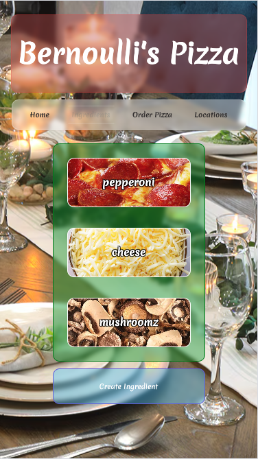

# Pizza Builder

Allows a user to build and order a pizza from a local restaurant chain.

## Models

There are four models: locations, ingredients, toppings, pizzas. Each pizza has one location and many toppings. Each topping has one ingredient, and an amount of that ingredient on the left side or the right side.

## Building an order

The user is able to add toppings and specify on which half, and how much. The app will also tally the total calores and price based on the toppings.

## Stretch Goals

The image will display colored shapes representing ingredients as the ingredients are selected

## Image of Pizza for reference

:max_bytes(150000):strip_icc()/6776_Pizza-Dough_ddmfs_2x1_1725-fdaa76496da045b3bdaadcec6d4c5398.jpg)

## Notes
Several sections of this were completed with the aid of ChatGPT, including the page for ordering pizzas and specifying the amount of toppings, and the associated models and sequalizers.

